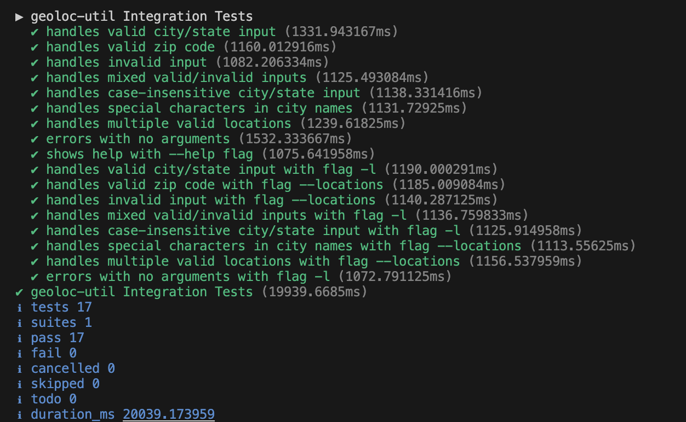

# fetch_sdet_coding_exercise

# Geoloc Utility

A command-line utility to fetch geographic coordinates using OpenWeather's Geocoding API.


## Features

- 📍 Get latitude/longitude for US locations
- 🏙️ Supports city/state and zip code inputs
- 🛠️ Error handling
- 🧪 Integration tests

## Installation

### Prerequisites
- Node.js v18+
- npm v9+

```bash
# Clone repository
git clone https://github.com/merugaJS/fetch_sdet_coding_exercise
cd fetch_sdet_coding_exercise

# Install dependencies
npm install

# Install globally
npm install -g .

# Make the script executable
chmod +x src/index.ts

# Install ts-node globally if not already installed (to run geoloc-util without using any npx command):
npm install -g ts-node
```

## Configuration
### API Keys
    1. Find the API key from the  under Authorization section.
    2. You can also get API KEY from [Openweather](https://home.openweathermap.org/users/sign_up).
    3. Update .env file with the API_KEY
  ```javascript
  API_KEY={API KEY}
  ```

## Usage

### Basic Commands

#### Single location
```bash
geoloc-util "Madison, WI"
```

#### Multiple locations
```bash
geoloc-util 53703 "New York, NY" 90001
```

#### Using --locations flag
```bash
geoloc-util --locations "Los Angeles, CA" 90210
```

### Example Output
```json
[
  {
    "name": "Madison",
    "lat": 43.074761,
    "lon": -89.3837613,
    "country": "US",
    "state": "Wisconsin"
  },
  {
    "input": "00000",
    "error": "No results found for ZIP code"
  }
]
```
## Testing

#### Run integration tests
```bash
npm test
```

#### Test Passed


